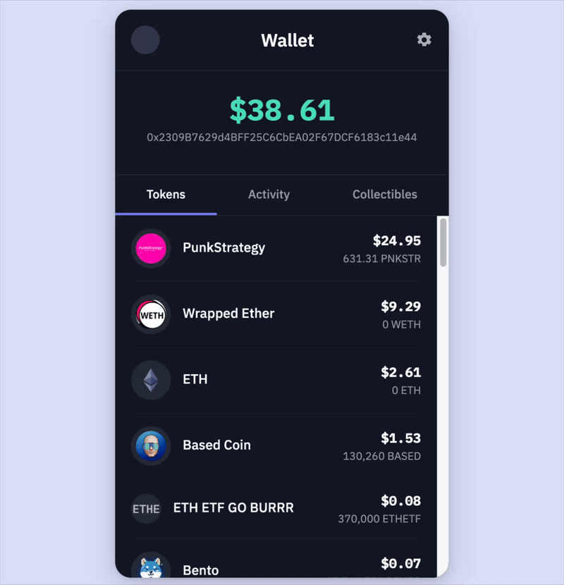

# Wallet UI

A clean and intuitive web interface for viewing cryptocurrency wallet balances and token holdings across EVM-compatible blockchains.

## Preview



*Wallet UI in action - view token balances and portfolio values in real-time*

## Features

- 🔍 View wallet token balances by entering any EVM wallet address
- 💰 Real-time USD value calculations for all tokens
- 🎨 Modern, responsive UI with clean design
- 🚀 Fast and lightweight Express.js backend
- 📊 Formatted token amounts and values using numbro
- 🔒 Secure API key management with environment variables

## Tech Stack

- **Backend**: Node.js with Express.js
- **View Engine**: EJS
- **Styling**: Custom CSS
- **API**: Dune Analytics SIM API for blockchain data
- **Dependencies**: 
  - `express` - Web framework
  - `ejs` - Template engine
  - `numbro` - Number formatting
  - `dotenv` - Environment variable management

## Prerequisites

- Node.js (v14 or higher)
- npm or yarn
- Dune Analytics SIM API key

## Installation

1. Clone the repository:
```bash
git clone https://github.com/aviexk/wallet-ui.git
cd wallet-ui
```

2. Install dependencies:
```bash
npm install
```

3. Create a `.env` file in the root directory:
```bash
SIM_API_KEY=your_dune_analytics_api_key_here
```

4. Start the server:
```bash
node server.js
```

5. Open your browser and navigate to:
```
http://localhost:3001
```

## Usage

1. Enter any EVM wallet address in the search field
2. View all token balances with their USD values
3. See the total portfolio value displayed at the top

## Project Structure

```
wallet-ui/
├── server.js           # Express server and API integration
├── views/
│   └── wallet.ejs      # Main wallet UI template
├── public/
│   └── styles.css      # Custom styling
├── package.json        # Project dependencies
├── .env               # Environment variables (not tracked)
└── README.md          # Project documentation
```

## API Integration

This project uses the Dune Analytics SIM API to fetch real-time blockchain data. The API provides:
- Token balances for any EVM wallet address
- USD values for tokens
- Token metadata (logos, URLs)
- Support for multiple chains

## Environment Variables

| Variable | Description | Required |
|----------|-------------|----------|
| `SIM_API_KEY` | Your Dune Analytics SIM API key | Yes |

## License

ISC

## Contributing

Contributions are welcome! Please feel free to submit a Pull Request.
